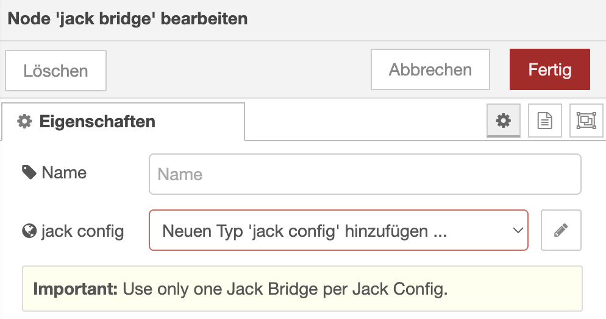

# node-red-contrib-ccu-jack

[![License][mit-badge]][mit-url]

> Node-RED Nodes for the Homematic CCU Addon - CCU-Jack

With these Nodes you can connect Homematic Devices from a [CCU](https://homematic-ip.com/en/product/smart-home-ccu3-central-control-unit) via [CCU-Jack](https://github.com/mdzio/ccu-jack) to 
[Node-RED](https://nodered.org/). Homematic is a series of smart home automation hardware from the manufacturer [eQ-3](http://www.eq-3.de/), popular especially in Germany.

**⚠️ @ptweety/node-red-contrib-ccu-jack requires Node-RED >= 3.0, Node.js >= 14.0 (>= 16.8.1 recommended) and CCU-Jack >= 2.4.**

## Installation

`npm install ptweety/node-red-contrib-ccu-jack`

## Configuration

1. Start with an import of the `jack-bridge.json`. You can find this in the [examples folder on GitHub](https://github.com/ptweety/node-red-contrib-ccu-jack/tree/master/examples) or directly in Node-RED.

1. Connect to the VEAP API of CCU-Jack

    

    Next, setup your `Jack Bridge` and `Jack Config` Nodes.

    

    

1. Connect to the MQTT Broker of CCU-Jack

    

## License

MIT (c) 2023 Matthias (ptweety) and contributors

[mit-badge]: https://img.shields.io/badge/License-MIT-blue.svg?style=flat
[mit-url]: LICENSE